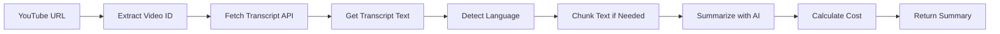

# 🎥 YouTube Video Summarization

YouTube videolarını otomatik olarak özetleyin - transcript çıkarma ve AI özetleme.

---

## ✨ Özellikler

- ✅ **Otomatik Transcript Çıkarma** - YouTube API'den transcript alır
- ✅ **Çoklu URL Format Desteği** - youtube.com, youtu.be, embed, vb.
- ✅ **Akıllı Özetleme** - Text özetleme ile aynı güçlü motor
- ✅ **Uzun Video Desteği** - Otomatik chunking ile sınırsız uzunluk
- ✅ **Çok Dilli** - Transcript ve özet dili ayrı ayrı
- ✅ **Maliyet Takibi** - Token bazlı maliyet hesaplama
- ✅ **Video Metadata** - Video ID, dil, URL bilgileri

---

## 🚀 Hızlı Başlangıç

### API Endpoint

```
POST /api/summarize/youtube
```

### Basit Kullanım

```bash
curl -X POST http://localhost:3000/api/summarize/youtube \
  -H "Content-Type: application/json" \
  -d '{
    "url": "https://www.youtube.com/watch?v=eVGCGlBt5fo"
  }'
```

### Gelişmiş Kullanım

```bash
curl -X POST http://localhost:3000/api/summarize/youtube \
  -H "Content-Type: application/json" \
  -d '{
    "url": "https://www.youtube.com/watch?v=eVGCGlBt5fo",
    "summary_length": "short",
    "bullet_points": true,
    "language": "tr"
  }'
```

---

## 📖 API Referansı

### Request Parameters

| Parameter | Type | Required | Default | Description |
|-----------|------|----------|---------|-------------|
| `url` | string | ✅ Yes | - | YouTube video URL |
| `summary_length` | string | ❌ No | `medium` | `short`, `medium`, `long` |
| `bullet_points` | boolean | ❌ No | `false` | Madde işaretli özet |
| `language` | string | ❌ No | auto | Özet dili (tr, en, vb.) |
| `custom_prompt` | string | ❌ No | - | Özel prompt |

### Response Format

```typescript
{
  summary: string                    // Üretilen özet
  original_length: number           // Transcript kelime sayısı
  summary_length: number            // Özet kelime sayısı
  detected_language: string         // Tespit edilen dil
  processing_time: number           // İşlem süresi (saniye)
  model_used: string               // Kullanılan AI modeli
  chunks_processed: number         // İşlenen chunk sayısı
  video_id: string                // YouTube video ID
  video_url: string               // Orijinal video URL
  transcript_language: string     // Transcript dili
  cost_estimate: {
    input_tokens: number
    output_tokens: number
    input_cost_usd: number
    output_cost_usd: number
    total_cost_usd: number
  }
}
```

---

## 🎯 Desteklenen URL Formatları

Tüm YouTube URL formatları desteklenir:

```javascript
// Standard watch URL
"https://www.youtube.com/watch?v=VIDEO_ID"

// Short URL
"https://youtu.be/VIDEO_ID"

// Embed URL
"https://www.youtube.com/embed/VIDEO_ID"

// Video URL
"https://www.youtube.com/v/VIDEO_ID"

// Query parameters ile
"https://www.youtube.com/watch?v=VIDEO_ID&t=123s"
```

---

## 💻 Programmatic Usage

### JavaScript/TypeScript

```typescript
async function summarizeYouTubeVideo(videoUrl: string) {
  const response = await fetch('http://localhost:3000/api/summarize/youtube', {
    method: 'POST',
    headers: { 'Content-Type': 'application/json' },
    body: JSON.stringify({
      url: videoUrl,
      summary_length: 'medium',
      language: 'tr'
    })
  })
  
  const data = await response.json()
  
  if (!response.ok) {
    throw new Error(data.error)
  }
  
  return {
    summary: data.summary,
    videoId: data.video_id,
    cost: data.cost_estimate.total_cost_usd
  }
}

// Kullanım
const result = await summarizeYouTubeVideo('https://www.youtube.com/watch?v=eVGCGlBt5fo')
console.log(result.summary)
console.log(`Cost: $${result.cost}`)
```

### React Component

```typescript
'use client'
import { useState } from 'react'

export default function YouTubeSummarizer() {
  const [url, setUrl] = useState('')
  const [summary, setSummary] = useState(null)
  const [loading, setLoading] = useState(false)
  
  const handleSummarize = async () => {
    setLoading(true)
    try {
      const response = await fetch('/api/summarize/youtube', {
        method: 'POST',
        headers: { 'Content-Type': 'application/json' },
        body: JSON.stringify({ url, summary_length: 'short' })
      })
      
      const data = await response.json()
      setSummary(data)
    } catch (error) {
      console.error(error)
    }
    setLoading(false)
  }
  
  return (
    <div>
      <input 
        value={url} 
        onChange={(e) => setUrl(e.target.value)}
        placeholder="YouTube URL"
      />
      <button onClick={handleSummarize} disabled={loading}>
        {loading ? 'Processing...' : 'Summarize'}
      </button>
      
      {summary && (
        <div>
          <h3>Video: {summary.video_id}</h3>
          <p>{summary.summary}</p>
          <small>Cost: ${summary.cost_estimate.total_cost_usd}</small>
        </div>
      )}
    </div>
  )
}
```

### Python

```python
import requests

def summarize_youtube_video(video_url: str, language: str = 'tr'):
    response = requests.post(
        'http://localhost:3000/api/summarize/youtube',
        json={
            'url': video_url,
            'summary_length': 'medium',
            'language': language
        }
    )
    
    response.raise_for_status()
    data = response.json()
    
    return {
        'summary': data['summary'],
        'video_id': data['video_id'],
        'cost': data['cost_estimate']['total_cost_usd']
    }

# Usage
result = summarize_youtube_video('https://www.youtube.com/watch?v=eVGCGlBt5fo')
print(result['summary'])
print(f"Cost: ${result['cost']}")
```

---

## 🧪 Testing

### Test Script

```bash
# Basic test
node test-youtube-summarize.js

# With options
node test-youtube-summarize.js --short --bullets

# Custom URL
node test-youtube-summarize.js --url "https://www.youtube.com/watch?v=VIDEO_ID"

# Test transcript API only
node test-youtube-summarize.js --test-transcript

# Health check
node test-youtube-summarize.js --health
```

### Manual Testing

```bash
# Health check
curl http://localhost:3000/api/summarize/youtube

# Summarize video
curl -X POST http://localhost:3000/api/summarize/youtube \
  -H "Content-Type: application/json" \
  -d '{"url":"https://www.youtube.com/watch?v=eVGCGlBt5fo"}'
```

---

## 📊 Örnek Senaryolar

### Senaryo 1: Kısa Video (5 dakika)

```json
{
  "url": "https://www.youtube.com/watch?v=SHORT_VIDEO",
  "summary_length": "short"
}
```

**Beklenen:**
- Transcript: ~750 kelime
- Özet: ~150 kelime
- İşlem süresi: 3-5 saniye
- Maliyet: ~$0.005

### Senaryo 2: Orta Video (30 dakika)

```json
{
  "url": "https://www.youtube.com/watch?v=MEDIUM_VIDEO",
  "summary_length": "medium"
}
```

**Beklenen:**
- Transcript: ~4,500 kelime
- Özet: ~600 kelime
- İşlem süresi: 10-15 saniye
- Maliyet: ~$0.035

### Senaryo 3: Uzun Video (2 saat) - Chunking

```json
{
  "url": "https://www.youtube.com/watch?v=LONG_VIDEO",
  "summary_length": "long"
}
```

**Beklenen:**
- Transcript: ~18,000 kelime
- Özet: ~2,000 kelime
- İşlem süresi: 30-60 saniye
- Chunking: 4-6 chunk
- Maliyet: ~$0.15

---

## ⚙️ Nasıl Çalışır?

### İşlem Akışı



### Adım Adım

1. **URL Validation**
   - YouTube URL formatını kontrol et
   - Video ID'yi çıkar

2. **Transcript Fetch**
   - AWS API Gateway'e istek at
   - Transcript text al
   - Dil bilgisini al

3. **Text Processing**
   - Transcript'i temizle
   - Uzunluğunu kontrol et
   - Gerekirse chunk'la

4. **Summarization**
   - Her chunk'ı özetle
   - Final özeti oluştur
   - Token sayısını hesapla

5. **Response**
   - Özeti döndür
   - Metadata ekle
   - Maliyet bilgisi ekle

---

## 💰 Maliyet Analizi

### Video Uzunluğuna Göre Maliyet

| Video Uzunluğu | Transcript | Özet | Maliyet |
|----------------|-----------|------|---------|
| 5 dakika | ~750 kelime | ~150 | **$0.005** |
| 15 dakika | ~2,250 kelime | ~400 | **$0.015** |
| 30 dakika | ~4,500 kelime | ~600 | **$0.035** |
| 1 saat | ~9,000 kelime | ~1,200 | **$0.075** |
| 2 saat | ~18,000 kelime | ~2,000 | **$0.150** |

### Aylık Kullanım Tahmini

**Düşük** (50 video/ay, ortalama 15 dk):
- **~$0.75/ay**

**Orta** (200 video/ay, ortalama 20 dk):
- **~$4.00/ay**

**Yüksek** (1,000 video/ay, ortalama 25 dk):
- **~$25/ay**

---

## 🐛 Sorun Giderme

### "No transcript available"

**Sebep:** Video için transcript yok  
**Çözüm:**
- Manuel altyazı eklenmiş videolar deneyin
- Otomatik altyazılı videolar tercih edin
- Farklı bir video deneyin

### "Invalid YouTube URL"

**Sebep:** URL formatı yanlış  
**Çözüm:**
- Standart YouTube URL kullanın
- Video ID'nin doğru olduğundan emin olun
- Desteklenen formatları kontrol edin

### "Transcript is too short"

**Sebep:** Transcript 100 karakterden kısa  
**Çözüm:**
- Daha uzun video seçin
- Video'nun gerçekten konuşma içerdiğinden emin olun

### "YouTube API error"

**Sebep:** Transcript API'ye erişim sorunu  
**Çözüm:**
- AWS API Gateway'in çalıştığından emin olun
- Network bağlantısını kontrol edin
- API endpoint'i doğrulayın

---

## 🔒 Güvenlik ve Limitler

### Rate Limiting

Transcript API'de rate limit olabilir:
- Çok fazla istek göndermeyin
- Retry logic implement edin
- Cache kullanın

### Privacy

- Video URL'leri loglanır (debugging için)
- Transcript'ler geçici olarak işlenir
- Özetler saklanmaz (isteğe bağlı)

### Best Practices

```typescript
// ✅ İyi: Cache kullan
const cache = new Map()

async function getCachedSummary(videoUrl: string) {
  if (cache.has(videoUrl)) {
    return cache.get(videoUrl)
  }
  
  const result = await summarizeYouTube(videoUrl)
  cache.set(videoUrl, result)
  return result
}

// ✅ İyi: Error handling
try {
  const summary = await summarizeYouTube(url)
} catch (error) {
  if (error.message.includes('No transcript')) {
    // Kullanıcıya bildir
  }
}

// ❌ Kötü: Rate limit yok
for (const url of manyUrls) {
  await summarizeYouTube(url) // Çok hızlı!
}
```

---

## 📚 İlgili Dokümantasyon

- [API_DOCS.md](./API_DOCS.md) - Complete API reference
- [REFACTORING.md](./REFACTORING.md) - Code architecture
- [COST_TRACKING.md](./COST_TRACKING.md) - Cost tracking details
- [lib/summarize.ts](./lib/summarize.ts) - Summarization logic

---

## 🎉 Özet

YouTube video özetleme artık tam entegre:
- ✅ Kolay kullanım
- ✅ Güçlü özetleme
- ✅ Maliyet takibi
- ✅ Type-safe API
- ✅ Production-ready

**YouTube videolarını dakikalar içinde özetleyin! 🚀**

